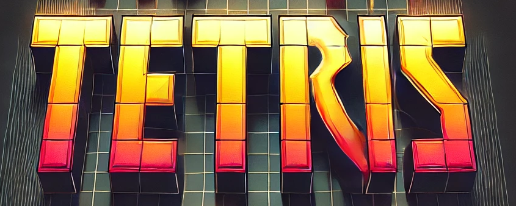

<center>



</center>


<center>


</center>


## Indice
- [Descripción](#descripción)
- [Características](#características)
- [Controles](#controles)
- [Instalación](#instalación)
- [Estructura del proyecto](#estructura-del-proyecto)
- [Tecnologías usadas](#tecnologías-usadas)
- [Contribuciones](#contribuciones)
- [Acerca de](#acerca-de)


## Descripción

Este proyecto es una implementación del clásico juego de Tetris. El objetivo del juego es mover y rotar las piezas que caen para completar líneas horizontales sin dejar huecos. Cuando una línea se completa, desaparece y se otorgan puntos al jugador. El juego termina cuando las piezas se acumulan hasta la parte superior de la pantalla.

## Características

- **Controles de teclado**: Usa las teclas de flecha para mover y rotar las piezas.
- **Música y efectos de sonido**: Activa o desactiva la música y los efectos de sonido desde el menú.
- **Guardar y mostrar la puntuación más alta**: La puntuación más alta se guarda en el almacenamiento local del navegador.
- **Niveles**: A medida que ganas puntos, el nivel del juego aumenta y las piezas caen más rápido.
- **Pieza en espera**: Puedes guardar una pieza para usarla más tarde.

## Controles

- **Mover a la izquierda**: Flecha izquierda
- **Mover a la derecha**: Flecha derecha
- **Mover hacia abajo**: Flecha abajo
- **Rotar**: Flecha arriba
- **Soltar rápidamente**: Barra espaciadora
- **Guardar pieza**: Tecla 'C'

## Instalación

1. Clona este repositorio en tu máquina local.
   ```sh
   git clone https://github.com/tu-usuario/tetris.git

2. Navega al directorio del proyecto
    ```sh
    cd tetris
    ```

3. Abre ```index.html``` en tu navegador favorito.

## Estructura del proyecto

    assets/
    images/
    sounds/
    index.css
    index.html
    scripts/
        boardTetris.js
        game.js
        grid.js
        main.js
        tetromino.js

## Tecnologías usadas

- **HTML**
- **CSS**
- **Javascript**

## Contribuciones

Las contribuciones son bienvenidas. Si tienes alguna idea o mejora, no dudes en abrir un issue.

## Acerca de

**GitHub:** [Neftalí Rodríguez Rodríguez](https://github.com/InKu3uS)

**Visita mi [Portfolio](https://devnefta.vercel.app/)**